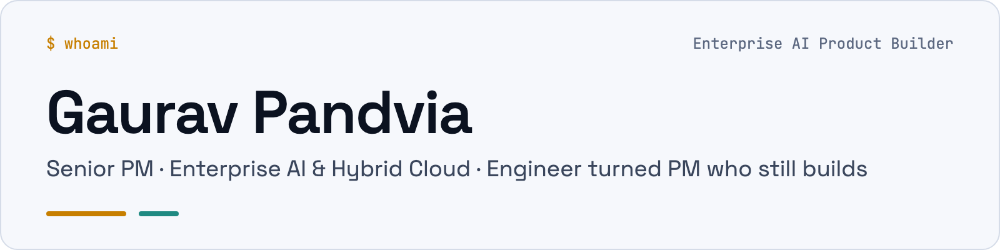
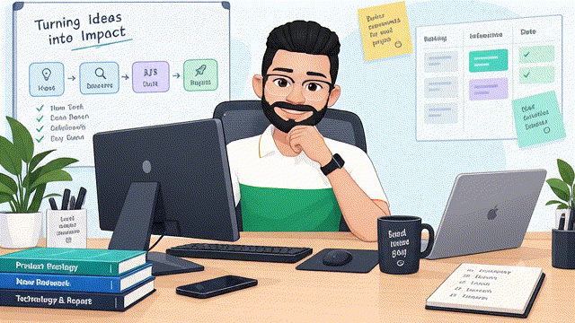
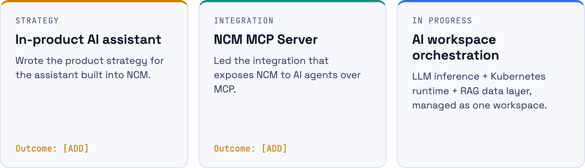
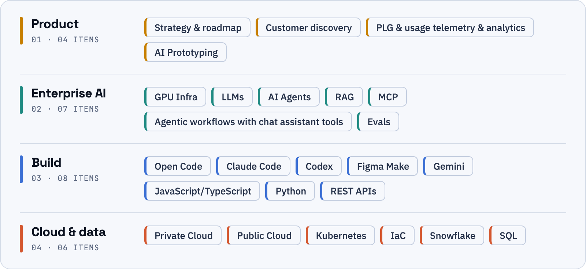
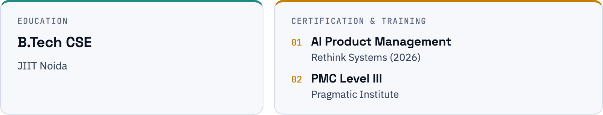
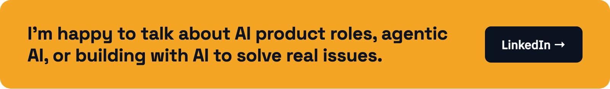

<picture>

  <source media="(prefers-color-scheme: dark)" srcset="assets/banner-dark.png">

  <source media="(prefers-color-scheme: light)" srcset="assets/banner-light.png">

  

</picture>

<table>

<tr>

<td width="50%" valign="middle">

- 🧩 <code>I turn complex, real-world problems into <b>tech-powered products</b>, breaking them down with first principles and systems thinking.</code>
- 🏢 <code>By day, I work on an <b>Enterprise product for 6,000+ customers</b> managing private Cloud Infrastructure workloads.</code>
- 🚀 <code>I'm relentlessly building with <b>AI</b> to ship what works.</code>
- 🧪 <code>On weekends, I experiment with AI.</code>

</td>

<td width="50%" align="center" valign="middle">

</td>

</tr>

</table>

`$200M+ ARR product (Nutanix Cloud Manager)` · `6,000+ customers` · `10+ yrs enterprise tech`

[LinkedIn](https://www.linkedin.com/in/gaurav-pandvia) · [Resume](./Gaurav_Pandvia_Resume.pdf) · [Email](mailto:gaurav.pandvia@gmail.com) · [Website](https://gauzpan.github.io/gauzpan/)

---

## Day job: Nutanix

Senior Product Manager on **NCM**, a $200M+ ARR product serving 6,000+ customers. My current focus: making AI a first-class part of how they run their private clouds.

<picture>

  <source media="(prefers-color-scheme: dark)" srcset="assets/nutanix-dark.png">

  <source media="(prefers-color-scheme: light)" srcset="assets/nutanix-light.png">

  

</picture>

Customer discovery with multiple enterprise customers · 4+ years in product management after 7 years as a full-stack engineer.

### Past work areas

Before AI, I owned these areas of the platform.

<picture>

  <source media="(prefers-color-scheme: dark)" srcset="assets/past-work-dark.png">

  <source media="(prefers-color-scheme: light)" srcset="assets/past-work-light.png">

  

</picture>

---

## AI Build Quests & Prototypes

<table>

<tr>

<td width="24%" valign="middle">

 <b><a href="https://github.com/gauzpan/rideinsync">RideInSync</a></b> 

</td>

<td width="46%" valign="middle">

Keeps riders in a group coordinated with live position tracking, and lets them raise an SOS for immediate emergency response. 
<b>AI angle: Voice AI to nudge riders while riding</b> 
 Working to further enhance.

</td>

<td width="30%" valign="middle" align="center">

 

</td>

</tr>

<tr>

<td colspan="3">

</td>

</tr>

<tr>

<td width="24%" valign="middle">

 <b><a href="https://github.com/gauzpan/karma-setu">CivicRouter</a></b> 

</td>

<td width="46%" valign="middle">

Citizens don't know who represents them or where to take an issue. 
<b>AI angle: RAG pipeline to index and retrieve the government information regarding department name, roles and responsibility to answer chat based user query</b>

</td>

<td width="30%" valign="middle" align="center">

 

</td>

</tr>

<tr>

<td colspan="3">

</td>

</tr>

<tr>

<td width="24%" valign="middle">

 <b><a href="https://github.com/gauzpan/charaka-ai-elearning">Charaka AI</a></b> 

</td>

<td width="46%" valign="middle">

Doctors want to learn AI, but content is written for engineers. 
<b>AI angle: GenAI Sandbox to practice prompt engineering specific to the industry</b> 

</td>

<td width="30%" valign="middle" align="center">

</td>

</tr>

<tr>

<td colspan="3">

</td>

</tr>

<tr>

<td width="24%" valign="middle">

 <b><a href="https://github.com/gauzpan/agent-management-portal">Agent Management Portal</a></b> 

</td>

<td width="46%" valign="middle">

Helps Australian colleges manage recruitment agent applications and lifecycle, for better compliance and faster processing. 
<b>AI angle: Scan of agent uploaded application form to identify incorrect information as first level pass </b> 

</td>

<td width="30%" valign="middle" align="center">

</td>

</tr>

<tr>

<td colspan="3">

</td>

</tr>

<tr>

<td width="24%" valign="middle">

 <b>Tooti Gullak</b> 

</td>

<td width="46%" valign="middle">

Gig workers with irregular income have no tools to save. 

</td>

<td width="30%" valign="middle" align="center">

</td>

</tr>

<tr>

<td colspan="3">

</td>

</tr>

<tr>

<td width="24%" valign="middle">

 <b>Loom</b> 

</td>

<td width="46%" valign="middle">

Seniors face isolation and find it hard to make meaningful connections. 

</td>

<td width="30%" valign="middle" align="center">

</td>

</tr>

</table>

All projects are proofs of concept built with AI assistance .

---

## How I think about products

- **Find where the loop breaks.** The visible complaint is rarely the problem. Users usually aren't short of content or tools; they're short of the right match or a clear path.
- **Continuous Discovery.** Start with the problem, learn from users, break it down, explore possibilities, build, measure, learn, and repeat. The goal isn't to build more, it’s to build what matters.
- **Go where incumbents aren't.** I'd rather own an uncontested niche than fight on features the market leaders already do well.
- **Treat trust as a constraint.** No answer beats a confident wrong one. AI says it's AI, and sensitive data has no way in.
- **Design for real behaviour.** People act under pressure, not as planned. Products should bend with them, not break.
- **Separate buyer from user.** Whoever pays and whoever uses often differ. Each needs their own reason to say yes.
- **Rules first, AI where it earns it.** A deterministic path that always works, AI on top. I measure outcomes, not time in app.

## About me

- **Engineer turned PM.** 7 years as a full-stack engineer before moving into product, so I still sneakingly sometime read the code and feel comfortable to talk architecture with my teams.
- **I prototype to learn.** I use AI coding harnesses like Claude Code, Open Code, Codex, Cursor to turn a hypothesis into a working PoC in days, then test it with real users.
- **Society Welfare.** I believe in do good, spread joy, good Karma. I led 100 volunteers at an NGO called Make A Difference, Bangalore, designing foundational learning programs for 200+ children under the age of 10 living in shelter homes.

---

## Toolkit

<picture>

  <source media="(prefers-color-scheme: dark)" srcset="assets/toolkit-dark.png">

  <source media="(prefers-color-scheme: light)" srcset="assets/toolkit-light.png">

  

</picture>

## Education

<picture>

  <source media="(prefers-color-scheme: dark)" srcset="assets/education-dark.png">

  <source media="(prefers-color-scheme: light)" srcset="assets/education-light.png">

  

</picture>

---

## Let's talk

<a href="https://www.linkedin.com/in/gaurav-pandvia"> 

</a>

The best way to reach me is [LinkedIn](https://www.linkedin.com/in/gaurav-pandvia).

Last updated October 2026